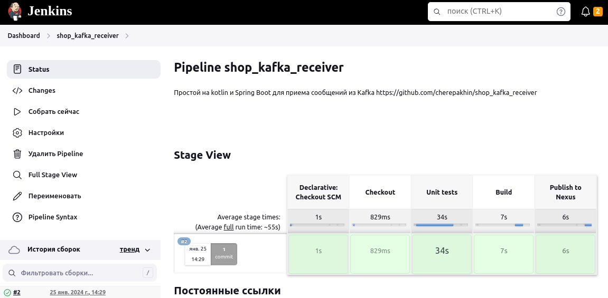

## Простой проект на Kotlin и Spring Boot для приема сообщений из очереди Kafka

### Оглавление:
[Цель](#target)<br/>
[Параметры запуска сервера Kafka](#parameters)<br/>
[Проверка работы с Kafka из shell](#work_in_shell)<br/>

[Установка параметров запуска](#set_run_params)<br/>
[Запуск проекта](#run_consumer)<br/>
[Ручная отправка в очередь из консоли продюсера](#manual_send)<br/>

[Сборка Jenkins](#jenkins)<br/>
[Deploy to NEXUS repository](#nexus)<br/>

[Ссылки](#links)<br/>

<a id="target"></a>
### Цель

Cоздать небольшое приложение на <b>Kotlin</b> с использованием <b>Spring Boot</b> для работы с <b>Kafka</b>.
Основной проект [https://github.com/cherepakhin/shop_kotlin](https://github.com/cherepakhin/shop_kotlin).
Программа будет принимать описания товаров из очереди Kafka и обновлять описания товаров через REST внешнего проекта shop_kotlin, используя [Spring RestTemplate](https://docs.spring.io/spring-framework/docs/current/javadoc-api/org/springframework/web/client/RestTemplate.html).

__Все описано для linux!!!__

<a id="parameters"></a>
### Параметры запуска <ins>СЕРВЕРА</ins> Kafka

[Параметры сервера Kafka server.properties](https://github.com/cherepakhin/shop_kafka_consumer/blob/dev/doc/server.properties)

Ключевые параметры в server.properties (~/tools/kafka/config/server.properties):

```text
...
listeners=PLAINTEXT://192.168.1.20:9092
...
zookeeper.connect=192.168.1.20:2181
```

<a id="check_status_in_shell"></a>
### Проверка работы с Kafka из shell

Проверка статуса сервиса Kafka:

````shell
$ sudo systemctl status kafka.service
...
> systemd[1]: Stopped Kafka Service.
...
````

Сервис остановлен.

### Запуск Kafka из shell

````shell
$ sudo systemctl start kafka.service
````

Проверка статуса:

````shell
$ sudo systemctl status kafka.service
...
Active: active (running)
...
systemd[1]: Started Kafka Service.

````
Описание сервисов:

[zookeeper.service](https://github.com/cherepakhin/shop_kafka_consumer/blob/dev/doc/zookeeper.service)
[kafka.service](https://github.com/cherepakhin/shop_kafka_consumer/blob/dev/doc/kafka.service)

<a id="work_in_shell"></a>
### Проверка работы с Kafka из shell

Отправка сообщения:

````shell
~$ ~/tools/kafka/bin/kafka-console-producer.sh --bootstrap-server 192.168.1.20:9092 --topic samples
>MES
>MES1
>
````

Прием сообщения:

````shell
~$ ~/tools/kafka/bin/kafka-console-consumer.sh --bootstrap-server 192.168.1.20:9092 --topic samples
MES
MES1
````


<a id="set_run_params"></a>
### Установка параметров запуска

Порт программы задается в application.yaml (по умолчанию 8990)

````yaml
server:
  port: ${API_PORT:8990}
````

Для установки переменной API_PORT выполнить:

````shell
export API_PORT=8990
````

Адрес сервера Kafka в environment переменной KAFKA_SERVER (по умолчанию 192.168.1.20:9092). 
Для установки переменной KAFKA_SERVER выполнить:

````shell
export KAFKA_SERVER=192.168.1.20:9092
````

<a id="run_consumer"></a>
### Запуск проекта

````shell
~$ ./gradlew bootRun
[ntainer#0-0-C-1] o.s.k.l.KafkaMessageListenerContainer    : test_id: partitions assigned: [json_topic-0]
[ntainer#1-0-C-1] o.s.k.l.KafkaMessageListenerContainer    : test_id: partitions assigned: [test_topic_text-0]
````

Запущено слушатели для очередей "product_ext_dto_json", "product_ext_dto_topic" .

<a id="manual_send"></a>
### Ручная отправка в очередь из консоли продюсера для простой проверки работоспособности 


Скрипт для тестовых отправок в очередь [doc/run-producer.sh](https://github.com/cherepakhin/shop_kafka_consumer/blob/dev/doc/run-producer.sh)

Отправка текстовых сообщений:

````shell
$ ./doc/run-producer.sh text_topic
>MESSAGE_TEXT
````

Тестовый сервис приема сообщений из топика __"text_topic"__:
[KafkaConsumerTestTopicTextService.kt](https://github.com/cherepakhin/shop_kafka_consumer/blob/dev/src/main/kotlin/ru/perm/v/shopkotlin/kafka_consumer/KafkaConsumerTextTopicService.kt)

Тестовый сервис приема сообщений из топика __"product_ext_dto_topic"__:
[KafkaConsumerProductExtDTOJsonTopicService.kt](https://github.com/cherepakhin/shop_kafka_consumer/blob/dev/src/main/kotlin/ru/perm/v/shopkotlin/kafka_consumer/KafkaConsumerJsonTopicService.kt)

Логирование принятого сообщения в программе из топика "text_topic":

````shell
INFO 10436 --- [ntainer#1-0-C-1] .v.s.k.KafkaConsumerTestTopicTextService : MESSAGE_TEXT
````

### Ручная проверка приема JSON из топика "product_ext_dto_topic"

````shell
$ ./run-producer.sh product_ext_dto_topic
> {"n":10,"name":"NAME_10","groupDtoN":100}
````

или

````shell
$./doc/run-producer.sh product_ext_dto_topic < ./doc/product.json
````
(выполнять из корня проекта)

В лог будет выведено:

```text
KafkaConsumerProductExtDTOJsonTopicService : ProductExtDTO(n=10, name='NAME_10', groupDtoN=100)

```

<a id="jenkins"></a>
### Сборка Jenkins

Сборка описана в [Jenkinsfile](https://github.com/cherepakhin/shop_kafka_consumer/blob/dev/Jenkinsfile)

Результаты сборки:



<a id="nexus"></a>
### Deploy to NEXUS repository

Для deploy выполнить:

````shell
./gradlew publish
````

Путь к репозиторию установлен в build.gradle.kts:

````shell
url = uri("http://v.perm.ru:8082/repository/ru.perm.v/")
````

Для установки переменных доступа к Nexus repository выполнить в shell:

````shell
$ export NEXUS_CRED_USR=admin
$ export NEXUS_CRED_PSW=pass
````

<a id="links"></a>
### Ссылки

- [Основной проект](https://github.com/cherepakhin/shop_kotlin)
- [https://www.baeldung.com/rest-template](https://www.baeldung.com/rest-template)
- [Конфигурирование, запуск и работа с Kafka](http://v.perm.ru/main/index.php/homepage/66-konfigurirovanie-zapusk-i-rabota-s-kafka)
- [Apache Kafka with Kotlin](https://www.baeldung.com/kotlin/apache-kafka)